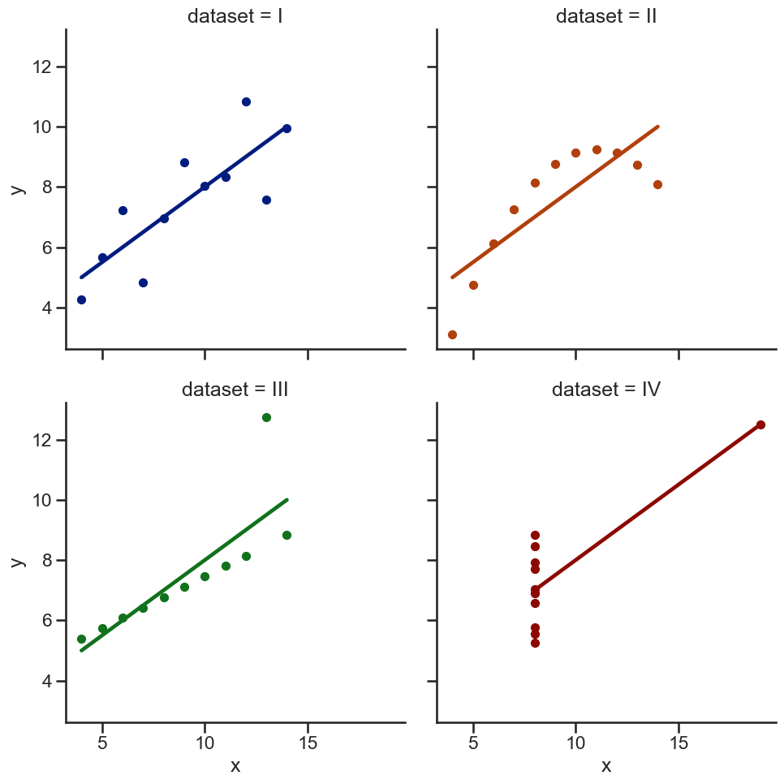
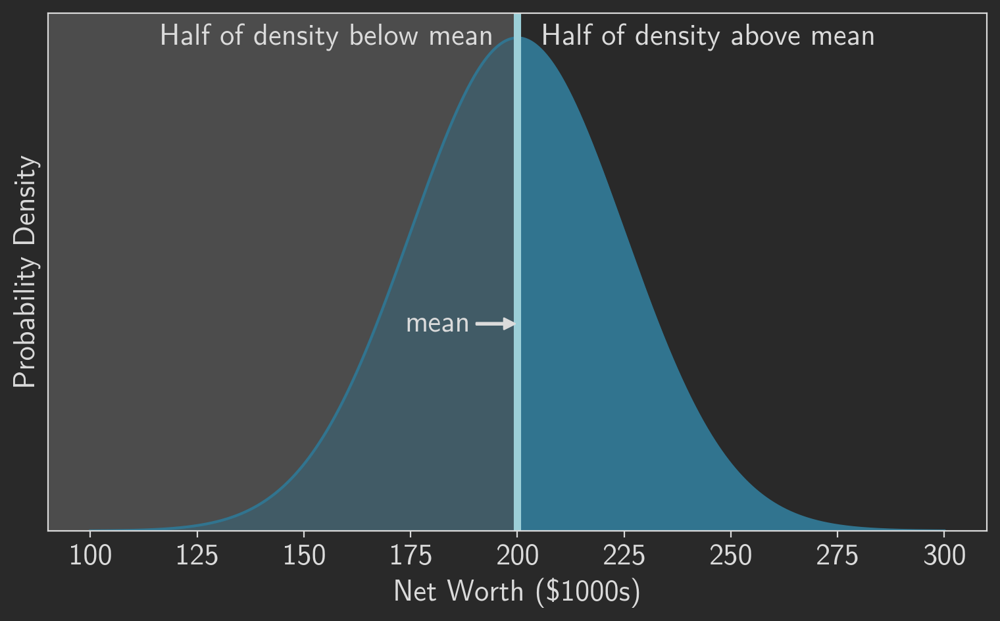

Those of you who like to read at night may have noticed that this site has a dark mode. Most pages use dark mode automatically following the lead of your computer’s operating system. When your computer switches to dark mode, the pages change with it. This particular page works differently. The button in the upper right corner lets you manually switch between light and dark mode; it’s there to make it easier to compare the two.

There’s nothing special about most of the implementation, so I won’t bore you with the details. Dark mode obviously changes the colors for the background and text. It also reduces the brightness of images such as photographs.

<figure>


<figcaption>NCATS biologist Michele Ceribelli, Ph.D., prepares samples for a high-throughput flow cytometry analysis in a 384 well plate. Credit: Daniel Soñé Photography, <abbr>LLC</abbr>. (<a src="https://www.flickr.com/photos/64860478@N05/37821508295/in/photostream/">Public Domain</a>.)</figcaption>

</figure>

Charts and plots provide more control and flexibility, so I can create optimized light and dark mode versions. Here’s a light mode example.

```python
import seaborn as sns
import matplotlib.pyplot as plt

df = sns.load_dataset("anscombe")
sns.set(style="ticks", context="talk")
sns.lmplot(
    x="x",
    y="y",
    col="dataset",
    hue="dataset",
    data=df,
    col_wrap=2,
    ci=None,
    palette="dark",
    scatter_kws={"s": 50, "alpha": 1},
)
```

The dark mode version uses different chart styles.

```python
plt.style.use("dark_background")
sns.lmplot(
    x="x",
    y="y",
    col="dataset",
    hue="dataset",
    data=df,
    col_wrap=2,
    ci=None,
    palette="pastel",
    scatter_kws={"s": 50, "alpha": 1},
)
```

The web page includes both images, but only one is visible at a time. Switching to and from dark mode changes which image becomes visible.

<figure>





<figcaption>Charts of Anscombe’s Quartet.</figcaption>

</figure>

Since this page has the option to manually switch modes, you might ask why every page doesn’t offer that option. Unfortunately there is no practical way to do that without relying on JavaScript or cookies, and this site has neither. The problem is persistence. It is possible to manually change the mode on any given page (such as this one), but there is no way to share that preference with other pages. So if you were to manually set dark mode on a particular page, as soon as you navigated to a different page on the site, you would immediately be confonted with light mode again. That seems like a poor user experience, so regular pages simply copy the system preference.
