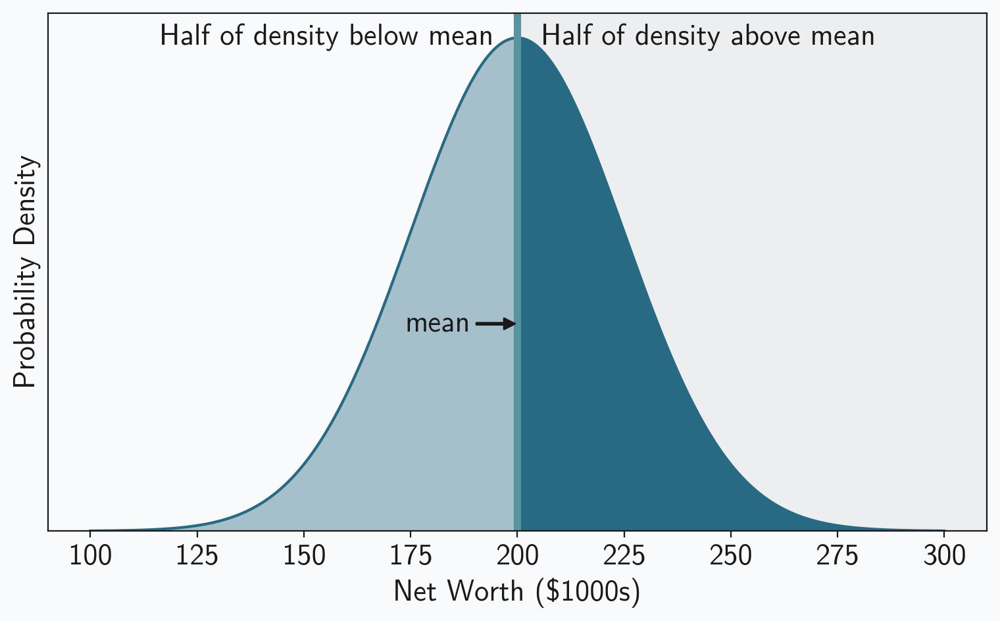

Those of you who read at night may have noticed that this site has a dark mode. Pages follow the lead of your web browser. When your browser switches to dark mode, they change with it. Or, at least, most pages do. This particular page works differently. There is a button in its upper right corner that manually sets light or dark mode. That button gives you direct control over the mode. This page is an exception because it discusses the site’s dark mode implementation, and I thought it would be helpful to let you directly compare the two styles.

The code that governs the mode is pretty simple, though it does rely on relatively recent features in the relevant web standards. The main control is a hidden checkbox that’s toggled _on_ and _off_ by the button:

```html
<input id="dark-mode" type="checkbox" name="dark-mode" hidden="true" />
<label for="dark-mode">
    <!-- svg icon here -->
</label>
```

The <abbr>CSS</abbr> styles change based on the state of that checkbox.

```css
html:has(#dark-mode:checked) {
    /* style changes for dark mode */
}
```

Most of the changes are straightforward: the background becomes dark gray and the text color changes to off-white, for example. To reduce the blinding effect of images, their brightness is reduced with a filter.

<figure>


<figcaption><abbr>NCATS</abbr> biologist Michele Ceribelli, Ph.D., prepares samples for a high-throughput flow cytometry analysis in a 384 well plate. Credit: Daniel Soñé Photography, <abbr>LLC</abbr>. (<a src="https://www.flickr.com/photos/64860478@N05/37821508295/in/photostream/">Public Domain</a>.)</figcaption>

</figure>

Charts and plots provide more control and flexibility, so they have optimized light _and_ dark mode versions using different chart styles. The web page includes both images, but only one is visible at a time. Switching to and from dark mode changes which image becomes visible.

<figure>




<figcaption>Sample chart to illustrate the differences between light and dark mode.</figcaption>

</figure>

Since this page lets you manually switch modes, you might ask why every page doesn’t offer that option. Unfortunately, any practical implementation requires JavaScript or cookies, and this site has neither.<label for="sn-1" class="sidenote-toggle sidenote-number"></label>
<input type="checkbox" id="sn-1" class="sidenote-toggle" />
<span class="sidenote">This constraint not only keeps the site’s implementation simple, it also ensures that you, as a reader, have complete privacy. There is no way I can track your behavior on the site.</span> The problem is persistence. It is possible to manually change the mode on any given page (such as this one), but there is no way to remember that preference and share it with other pages. So you could manually set dark mode on a particular page, but as soon as you navigated to a different page on the site, you would be confonted with light mode again. That would be frustrating and annoying, so I’ve stuck with what’s possible. Regular pages simply reflect the browser’s setting.
