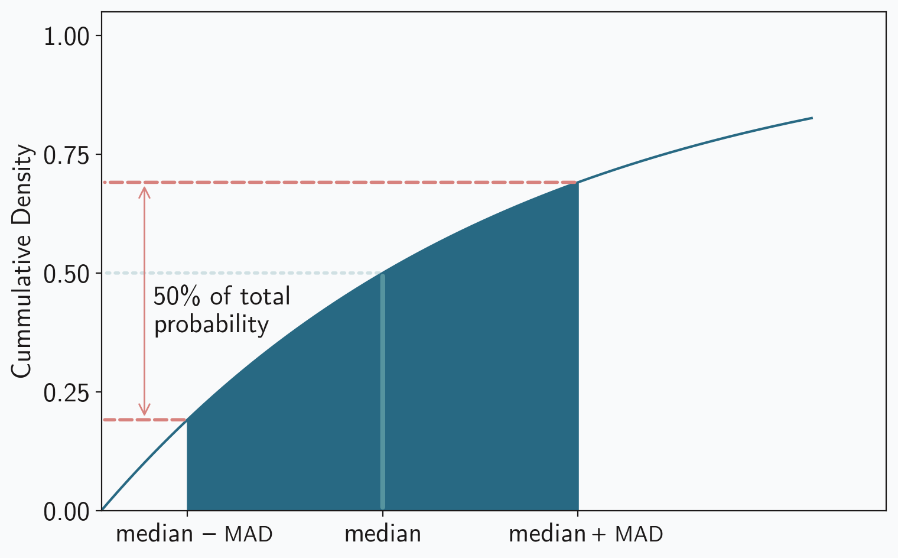
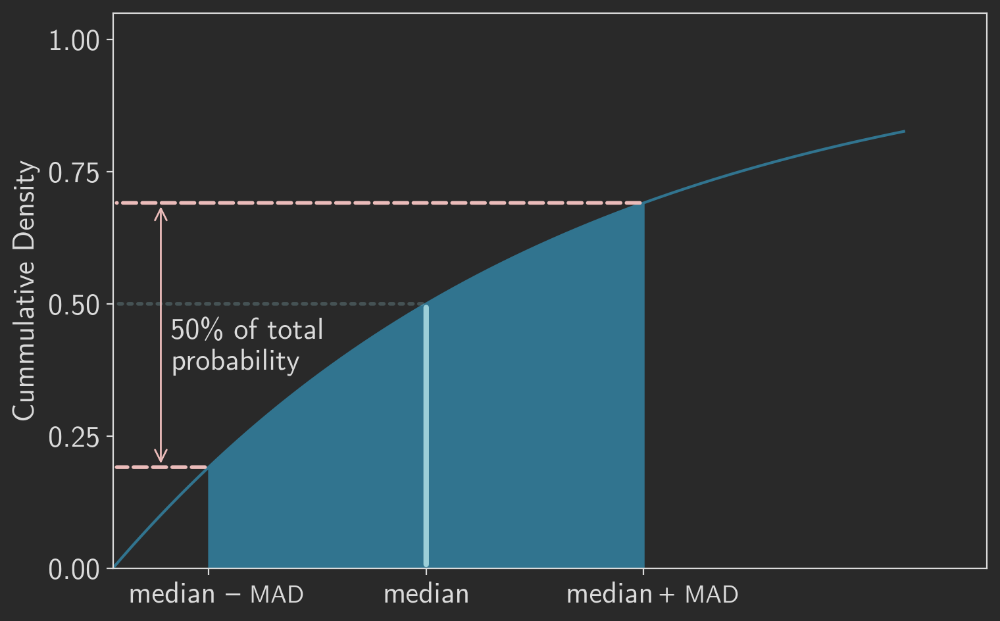

The [last post](/blog/robuststats/) introduced robust statistics as an alternative to traditional statistics. Robust statistics reduce the sometimes outsized and undesirable influence of outliers in data sets. When we want that reduction, we can describe data with robust measures such as the median and the median absolute deviation (<abbr>MAD</abbr>) instead of the mean and standard deviation. These robust measures, however, aren’t always directly comparable to the traditional ones. As we saw with the normal distribution, we can make them directly comparable with a scaling factor. But what about other distributions? We can always calculate the median and <abbr>MAD</abbr> of a data set, but how do we scale those values appropriately? This post examines a few approaches for dealing with non-normal distributions. We’ll start with some simple symmetric distributions and then consider a couple of important assymetric ones. Although these techniques won’t work for every possible distribution, they can be adapted for almost any important one.

## Symmetric Distributions

When a data set is sampled from a symmetric distribution, even if that distribution isn’t the normal distribution, we may still be able to use the same approach to determine an appropriate scaling factor. All symmetric distributions possess two properties that we relied on for our previous analysis:

1. The mean and the median are the same, and
2. The <abbr>MAD</abbr> equals the 75th percentile value minus the median.

When the <abbr>MAD</abbr> is linearly proportional to the distribution’s standard deviation, a constant scaling factor exists, and it is easy to calculate. Here are a couple of quick examples to demonstrate the approach.

### Uniform Distribution

The continuous uniform distribution may be the simplest example. If the lower and upper limits of the distribution are $a$ and $b$ respectively, its <abbr>MAD</abbr> is $(b - a)/4$. The standard deviation of a uniform distribution is $(b - a)/\sqrt{12}$, so the <abbr>MAD</abbr> is linearly proportional to $\sigma$. The robust versions of the traditional statistical measures, therefore, can be easily calculated:

- “robust mean” = median
- “robust standard deviation” = $\sqrt{4/3} \ \cdot$ <abbr>MAD</abbr>

### Laplace Distribution

The Laplace distribtion is another example where a constant scaling factor exists. Its 75th percentile is $\mu - b \ \text{ln}(2 - 2 \cdot 0.75)$ and its standard deviation is $\sqrt{2} \cdot b$. So for Laplace distributions,

- “robust mean” = median
- “robust standard deviation” = $-\sqrt{2} / \text{ln}(0.5) \ \cdot$ <abbr>MAD</abbr>

## Asymmetric Distributions

The calculations become a bit more complicated when we consider asymmetric distributions; to start, the median no longer necessarily equals the mean. In some cases, however, we can still derive scaling factors. …

### Exponential Distribution

Consider the exponential distribution with a rate $\lambda$. Such a distribution is defined by the probability density function (<abbr>PDF</abbr>) of equation 1.
$$
f(x) = \begin{cases}
\lambda e^{-\lambda x} & x\geq 0,\\
0 & x<0.
\end{cases}
$$
Even though it’s often easier to think about probabilities based on the <abbr>PDF</abbr>, it turns out that cummulative density function (<abbr>CDF</abbr>) is more convenient for our purposes. The <abbr>CDF</abbr> at a value $x$ defines the total probability for all values up $x$; it is 0 at $-\infty$ and 1 at $+\infty$. The exponential distribution’s <abbr>CDF</abbr> is defined by equation 2.
$$
F(x) = \begin{cases}
1 - e^{-\lambda x} & x\geq 0,\\
0 & x<0.
\end{cases}
$$
Given that definition, the median is the value of $x$ which accounts for half of the total probability. Solving $F(x) = 0.5$ tells us that the median is $\mathrm{ln}(2)/\lambda$. And since the mean of an exponential distribution is $1/\lambda$, we have our first scaling constant.

- “robust mean” = $1/\mathrm{ln}(2) \ \cdot$ median

To find a scaling constant for the standard deviation, we need an expression for the exponential distribution’s median absolute deviation. Because the distribution isn’t symmetric, we can’t simply find the 75th percentile as we’ve done before. Instead, we have to think in terms of the <abbr>CDF</abbr>. Since we’re looking for the _median_ absolute deviation, we want to find a value which half of the deviations exceed and half fall below. The range of values from the median minus the <abbr>MAD</abbr> to the median plus the <abbr>MAD</abbr> are all of the values for which the deviation is less than the <abbr>MAD</abbr>. For that range to account for half of the total probability, the difference between the <abbr>CDF</abbr> values at those edges must be 0.5. Figure 1 shows the situation graphically.

<figure>





<figcaption>The exponential distribution’s <abbr>MAD</abbr> can be derived using the cummulative density function. The change in the <abbr>CDF</abbr> from the median minus the <abbr>MAD</abbr> to the median plus the <abbr>MAD</abbr> equals 0.5, or half of the total probability.</figcaption>

</figure>

To find the <abbr>MAD</abbr>’s value, we solve for it using the <abbr>CDF</abbr>; Equation 3 shows the steps. That equation uses $m$ to represent the median, and, as we found above, it is equal to $\mathrm{ln}(2)/\lambda$. The last step relies on the definition of the hyperbolic sine function.
$$
\begin{aligned}
0.5 &= F(m + {\small \mathrm{MAD}}) - F(m - {\small \mathrm{MAD}}) \\
    &= \left[1 - e^{-\lambda (m + {\small \mathrm{MAD}})}\right] - \left[1 - e^{-\lambda (m - {\small \mathrm{MAD}})}\right] \\
    &= e^{-\lambda (m - {\small \mathrm{MAD}})} \ - e^{-\lambda (m + {\small \mathrm{MAD}})} \\
    &= e^{-\lambda (\mathrm{ln}(2)/\lambda - {\small \mathrm{MAD}})} \ - e^{-\lambda (\mathrm{ln}(2)/\lambda + {\small \mathrm{MAD}})} \\
    &= e^{-\mathrm{ln}(2) + \lambda \cdot {\small \mathrm{MAD}}} \ - e^{-\mathrm{ln}(2) - \lambda \cdot {\small \mathrm{MAD}}} \\
    &= \frac{1}{2}e^{\lambda \cdot {\small \mathrm{MAD}}} \ - \frac{1}{2}e^{- \lambda \cdot {\small \mathrm{MAD}}} \\
    &= \frac{1}{2} \left( e^{\lambda \cdot {\small \mathrm{MAD}}} - e^{- \lambda \cdot {\small \mathrm{MAD}}} \right) \\
    &= \mathrm{sinh}(\lambda \cdot {\small \mathrm{MAD}})
\end{aligned}
$$
Now we know the <abbr>MAD</abbr> for the exponential distribution is $(1/\lambda) \mathrm{arcsin}(0.5)$. And since the distribution’s standard deviation is $(1/\lambda)$, a constant scaling factor exists.

- “robust standard deviation” = $1/\mathrm{archsinh}(0.5) \ \cdot$ <abbr>MAD</abbr>

This result is actually pretty remarkable. The standard deviation is linearly proportional to the median absolute deviation, independent of the rate parameter. That, along with the similar result for the mean and median, makes it easy to calculate comparable robust measures to characterize samples from exponentially distributed data. To see these calculations in action, and to demonstrate the benefits of robust statistics, let’s look at some data.

The code below generates random samples from the exponential distribution with a range of values for the rate. Each data set contains 500,000 samples, 500 of which are replaced by outliers. For each set the code records the rate, the theoretical population mean and standard deviation, the  measured mean and standard deviation, and the scaled median and <abbr>MAD</abbr>.

```python
import numpy as np
from scipy import stats

np.random.seed(42)

sample_stats = []
for rate in [0.01, 0.02, 0.05, 0.1, 0.2, 0.5, 1, 2, 5, 10, 20, 50, 100]:
    sample = np.random.exponential(scale=1/rate, size=500000)
    sample[0:500] = [10 / rate] * 500 # replace some samples with outliers
    mean = np.mean(sample)
    median = np.median(sample)
    std = np.std(sample)
    mad = stats.median_abs_deviation(sample)
    sample_stats.append({
        'scale': 1/rate,
        'mean': mean,
        'median': median / np.log(2),
        'std': std,
        'MAD': mad / np.arcsinh(0.5)
    })
```

We can see the results in table 1. In every case the robust measures provide better estimates of the population because they’re more resistant to the outliers.

: Comparison of traditional and robust measures for multiple samples from various exponential distributions. Each row summarizes 499,500 values randomly sampled from a distribution, combined with 500 outliers. The first column shows the true mean and standard deviation of the population. The remaining columns show estimates for those values calculated from the sample. Both the median and the <abbr>MAD</abbr> are scaled using the constants derived in the text.

| $1/\lambda$ |      mean |    median |       std | <abbr>MAD</abbr> |
| :---------- | --------: | --------: | --------: | ---------------: |
| 100         |   100.915 |   100.402 |   103.785 |          100.259 |
| 50          |    50.551 |   50.0924 |   52.1248 |             50.1 |
| 20          |   20.1286 |   19.9545 |   20.7696 |          19.9232 |
| 10          |   10.0845 |   9.99321 |   10.3939 |          9.99038 |
| 5           |   5.04606 |   5.00884 |   5.19349 |          5.01482 |
| 2           |   2.01871 |   2.00739 |   2.07618 |           2.0066 |
| 1           |   1.00934 |   1.00071 |   1.03901 |          1.00206 |
| 0.5         |  0.505241 |  0.500282 |  0.521129 |         0.500673 |
| 0.2         |  0.201304 |  0.200197 |  0.206938 |         0.200334 |
| 0.1         |  0.100962 |  0.100042 |  0.104042 |         0.100303 |
| 0.05        | 0.0503882 | 0.0500686 | 0.0519559 |        0.0500084 |
| 0.02        | 0.0201809 | 0.0200964 | 0.0207433 |         0.020095 |
| 0.01        | 0.0100915 | 0.0100002 | 0.0103998 |        0.0100301 |

### Log-normal Distribution

The examples we’ve looked at so far might give the impression that it’s always possible to relate robust measures to traditional ones. Unfortunately that’s not the case. To see how our approach can fail, consider the log-normal distribution. This distribution represents a random variable whose logarithm is normally distributed. The parameters are typically labeled $\mu$ and $\sigma$, but these are not the mean and standard deviation of the distribution. They _are_ the mean and standard deviation of the underlying normal distribution of the random variable’s logarithm. To avoid confusion, we’ll refer to them using the more general terminology of _location_ and _scale,_ respectively.

Finding the expected median of a log-normal distribution is simple enough. Recall that it’s the “middle” value when all possible values are listed in order. Taking the logarithm of a list of numbers doesn’t change their relative order, so we can find the middle by first taking the logarithm of all values, then finding the median of those new values, and, finally, taking the anti-logarithm of that median (i.e. raise $e$ to the power of the value). In an earlier post we found the median of the normal distribution to be $\mu$, so the median of the log-normal distribution is $e^\mu$. All that we’re missing is the scaling factor to make the median comparable to the mean. The mean of a log-normal distribution is $e^{\mu + \frac{\sigma^2}{2}}$. (Derivations are readily available, so we won’t bother with one here.. The scaling constant, therefore, is $e^{\mu + \frac{\sigma^2}{2}} / e^{\mu}$, which simplifies to $e^{\sigma^2/2}$.

Of course, when we’re analyzing a sample data set, we probably don’t know the value of $\sigma$ for the log-normal population from which the sample came. If we knew the true values of the log-normal parameters, there would be little point in estimating from a sample. We can, however, calculate robust estimates for those parameters from our sample. Since $\mu$ and $\sigma$ represent the mean and standard deviation of the underlying _normal_ distribution, we can transform our log-normal sample into a normal sample and use the approach from the previous post to calculate those estimates.

For a robust standard deviation, we can use the same approach as we did for the exponential distribution. First we need to find the expected value of the log-normal median absolute deviation. It’s the value for <abbr>MAD</abbr> that satisfies equation 4.
$$
0.5 = F(e^\mu + {\small \mathrm{MAD}}) - F(e^\mu - {\small \mathrm{MAD}}) \\
$$
Unfortunately the cummulative distribution function for the log-normal distribution is rather complicated, and there is no known analytic solution for <abbr>MAD</abbr>. We have to resort to numerical methods, but at least there is convenient initial guess for the solution: we simply calculate the unscaled <abbr>MAD</abbr> from our sample. Dividing the log-normal standard deviation<label for="sn-1" class="sidenote-toggle sidenote-number"></label>
<input type="checkbox" id="sn-1" class="sidenote-toggle" />
<span class="sidenote">$\sigma^2 = \left( e^{\sigma^2} - 1 \right) \left( e^{2\mu + \sigma^2} \right)$</span> by the numerial value for <abbr>MAD</abbr> gives us the scaling factor.

Okay, this procedure is starting to look rather complicated. The log-normal distribution is certainly not as simple as other distributions we’ve considered. Even though there are more steps involved, however, the individual steps aren’t too bad. Following them carefully can still provide robust measures for log-normal data. Here is the complete process.

1. Start with a sample _X_ from a log-normal population with unknown parameters $\mu$ and $\sigma$, $X \sim \mathrm{LN}(\mu, \sigma)$.
2. Transform _X_ to _Y_, a normal population with those same parameters, by taking the natural logarithm of the data values; $Y = \mathrm{ln}(X)$, $Y \sim \mathrm{N}(\mu, \sigma)$.
3. Calculate robust estimates $\hat{\mu}$ and $\hat{\sigma}$ for the parameters of _Y_, $\hat{\mu} = \mathrm{median}(Y)$ and $\hat{\sigma} = 1.4826 \cdot \small{\mathrm{MAD}}(Y)$.
4. Estimate the log-normal scaling constants for _X_, $k_{\mathrm{mean}} = e^{\hat{\sigma}^2/2}$ and $k_{\mathrm{stdev}}$ based on the numerical solution of equation 4.
5. “robust mean” = $k_{\mathrm{mean}} \ \cdot$ median(_X_)
6. “robust  standard deviation” = $k_{\mathrm{stdev}} \ \cdot$ <abbr>MAD</abbr>(_X_)

Let’s see how this works in practice. As we’ve done before, we’ll synthesize a collection of random samples and contaminate those samples with some outliers. Since we’re generating the random samples from a known distribution, we know the “true” values for the mean and standard deviation. Therefore, when we calculate the traditional and robust measures from our samples, we can see which approach provides more accurate estimates.

```python
from scipy.optimize import fsolve

def lognormal_mean(mu, sigma):
    return np.exp(mu + (sigma**2)/2)

def lognorm_std(mu, sigma):
    return np.sqrt((np.exp(sigma**2) - 1) * np.exp(2*mu + sigma**2))

np.random.seed(42)

sample_stats = []
for mu in [-10, -1, 0, 1, 10]:
    for sigma in [0.1, 1, 2, 4]:
        sample = np.random.lognormal(mean=mu, sigma=sigma, size=500000)
        sample[0:500] = [np.exp(mu + 5 * sigma)] * 500 # replace some samples with outliers

        # descriptive statistics for the sample
        mean = np.mean(sample)
        median = np.median(sample)
        std = np.std(sample)
        mad = stats.median_abs_deviation(sample)

        # transform sample to normal distribution
        logsample = np.log(sample)

        # robust estimates of normal distribution parameters
        mu_est = np.median(logsample)
        sigma_est = stats.median_abs_deviation(logsample, scale="normal")

        # use robust estimates to estimate mean scaling constant
        c_est = np.exp((sigma_est**2)/2)

        # numerically solve for estimated standard deviation scaling constant
        cdf_est = stats.lognorm(s=sigma_est, scale=np.exp(mu_est)).cdf
        def func(x):
            return cdf_est(np.exp(mu_est) + x) - cdf_est(np.exp(mu_est) - x) - 0.5
        mad_est = fsolve(func, mad)
        k_est = lognorm_std(mu_est, sigma_est) / mad_est

        sample_stats.append({
            'mu': mu,
            'sigma': sigma,
            'pop_mean': lognormal_mean(mu, sigma),
            'mean': mean,
            'robust_mean': c_est * median,
            'pop_std': lognorm_std(mu, sigma),
            'std': std,
            'robust_std': k_est * mad
        })
```

Table 2 lists the results. By now you won’t be surprised to see that the robust measures provide better estimates of the true values, in some cases substantially better estimates.

: Comparison of traditional and robust measures for multiple samples from various log-normal distributions. Each row summarizes 499,500 values randomly sampled from a distribution, combined with 500 outliers. The first two columns show the distribution parameters. The remaining columns show the “true” values, the traditional estimates, and the robust estimates for the mean and standard deviation. ×10^-5^

| $\mu$ | $\sigma$ | true mean | estimated mean | robust mean |  true SD | estimated SD | robust SD |
| ----: | -------: | --------: | -------------: | ----------: | -------: | -----------: | --------: |
|   -10 |      0.1 |  4.56×10^-5^ |       4.57×10^-5^ |    4.56×10^-5^ | 4.57×10^-6^ |     4.67×10^-6^ |  4.59×10^-6^ |
|   -10 |        1 |  7.49×10^-5^ |       8.13×10^-5^ |    7.50×10^-5^ | 9.81×10^-5^ |     2.32×10^-4^ |  9.86×10^-5^ |
|   -10 |        2 |  3.36×10^-4^ |       1.34×10^-3^ |    3.39×10^-4^ | 2.46×10^-3^ |     3.17×10^-2^ |  2.51×10^-2^ |
|   -10 |        4 |     0.135 |           22.1 |       0.135 |      403 |          696 |       399 |
|    -1 |      0.1 |     0.370 |          0.370 |       0.370 |   0.0371 |       0.0378 |    0.0371 |
|    -1 |        1 |     0.607 |          0.659 |       0.608 |    0.796 |         1.88 |     0.798 |
|    -1 |        2 |      2.72 |           10.8 |        2.72 |     19.9 |          257 |      19.9 |
|    -1 |        4 |      1100 |        179,000 |        1120 | 3.27×10^6^ |     5.64×10^6^ |  3.42×10^6^ |
|     0 |      0.1 |      1.01 |           1.01 |        1.01 |    0.101 |        0.103 |     0.101 |
|     0 |        1 |      1.65 |           1.80 |        1.66 |     2.16 |         5.12 |      2.18 |
|     0 |        2 |      7.39 |           29.4 |        7.39 |     54.1 |          699 |      54.2 |
|     0 |        4 |      2980 |        487,000 |        3070 | 8.89×10^6^ |     1.53×10^7^ |  9.44×10^6^ |
|     1 |      0.1 |      2.73 |           2.73 |        2.73 |    0.274 |        0.279 |     0.274 |
|     1 |        1 |      4.48 |           4.89 |        4.49 |     5.87 |         13.9 |      5.89 |
|     1 |        2 |      20.1 |           80.0 |        20.5 |      147 |         1900 |       153 |
|     1 |        4 |      8100 |       1.32×10^6^ |        8170 | 2.42×10^7^ |     4.17×10^7^ |  2.45×10^7^ |
|    10 |      0.1 |    22,100 |         22,100 |      22,100 |     2220 |         2270 |      2220 |
|    10 |        1 |    36,300 |         40,000 |      36,600 |   47,600 |      112,000 |    48,200 |
|    10 |        2 |   163,000 |        647,000 |     163,000 | 1.19×10^6^ |     1.54×10^7^ |  1.20×10^6^ |
|    10 |        4 |  6.57×10^7^ |       1.07e+10 |    6.56×10^7^ | 1.96×10^11^ |     3.38×10^11^ |  1.93×10^11^ |

## Coliphon

Figure 1 was created with the following code:

```python
from matplotlib import font_manager, pyplot as plt

np.random.seed(42)

rate = 1

x = np.linspace(0, 1.75, 1000)

population = stats.expon(scale=1/rate)
cdf = population.cdf(x)

median = np.log(2) / rate
mad = np.arcsinh(0.5) / rate
x0 = median
x1 = median - mad
x2 = median + mad
y0 = population.cdf(x0)
y1 = population.cdf(x1)
y2 = population.cdf(x2)

imad = [i for i in range(len(x)) if x1 <= x[i] < x2]

color1 = plt.rcParams["axes.prop_cycle"].by_key()["color"][0]
color2 = plt.rcParams["axes.prop_cycle"].by_key()["color"][1]
color3 = plt.rcParams["axes.prop_cycle"].by_key()["color"][2]
color4 = plt.rcParams["axes.prop_cycle"].by_key()["color"][3]
color5 = plt.rcParams["axes.prop_cycle"].by_key()["color"][4]
color6 = plt.rcParams["axes.prop_cycle"].by_key()["color"][5]
textcolor = plt.rcParams["text.color"]

#--- Figure created in layers
fig, ax = plt.subplots(figsize=(7.88, 5), tight_layout=True)
ax.plot(x, cdf)
ax.set_ylabel("Cummulative Density")

# remove the bottom and left margin
ax.set_ymargin(0)
ax.autoscale_view()
lim = ax.get_ylim()
bottom = lim[0]
ax.set_ylim(bottom, 1.05)

lim = ax.get_xlim()
delta = np.diff(lim)
right = lim[1] + delta * 0.05
left = lim[0]
ax.set_xlim(0, right)

plt.fill_between(x[imad], cdf[imad], color=color1)

ax.annotate(
    "",
    xy=(x0, 0),
    xytext=(x0, y0),
    arrowprops=dict(color=color2, arrowstyle='-', linewidth=3)
)

ax.annotate(
    "",
    xy=(0, y0),
    xytext=(x0, y0),
    arrowprops=dict(color=color2, alpha=0.25, arrowstyle='-', linestyle=':', linewidth=2)
)

ax.annotate(
    "",
    xy=(0, y1),
    xytext=(x1, y1),
    arrowprops=dict(color=color3, arrowstyle='-', linestyle='--', linewidth=2)
)

ax.annotate(
    "",
    xy=(0, y2),
    xytext=(x2, y2),
    arrowprops=dict(color=color3, arrowstyle='-', linestyle='--', linewidth=2)
)

ax.annotate(
    "",
    xy=(x1/2, y1),
    xytext=(x1/2, y2),
    arrowprops=dict(color=color3, arrowstyle='<->')
)

ax.set_xticks(
    [x1, x0, x2],
    ['median –     ', 'median', 'median       ']
)
ax.text(x1, -0.053, "     MAD", size="small", horizontalalignment="left", verticalalignment="center")
ax.text(x2, -0.05, "  +", size="x-small", weight="bold", horizontalalignment="left", verticalalignment="center")
ax.text(x2, -0.053, "     MAD", size="small", horizontalalignment="left", verticalalignment="center")

ax.set_yticks([0, 0.25, 0.5, 0.75, 1.0])

ax.text(
    x1/2 * 1.2,
    (y1 + (y2-y1)/2) * 0.95,
    "50% of total\nprobability",
    horizontalalignment="left",
    verticalalignment="center"
)

plt.show()
```

