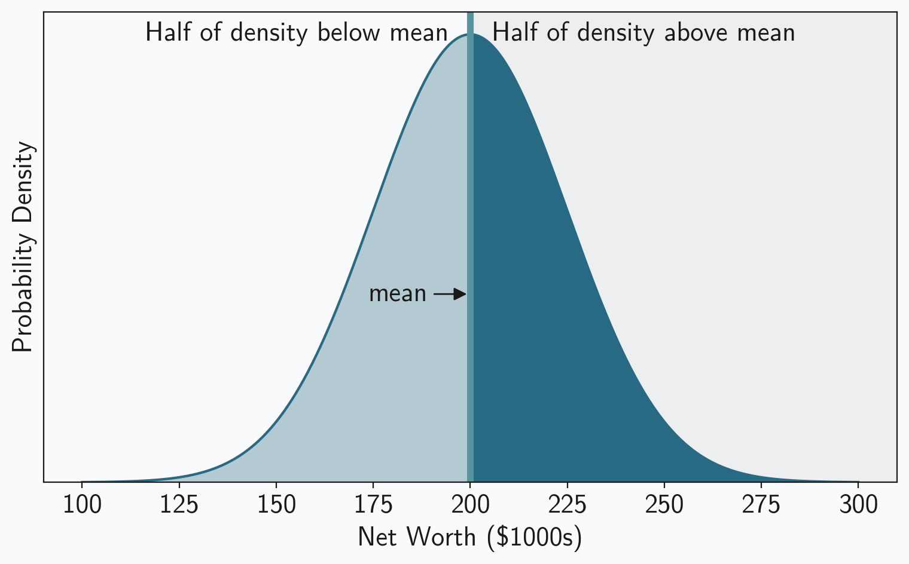
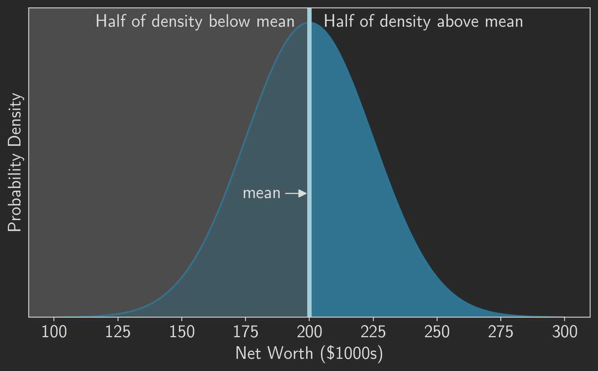
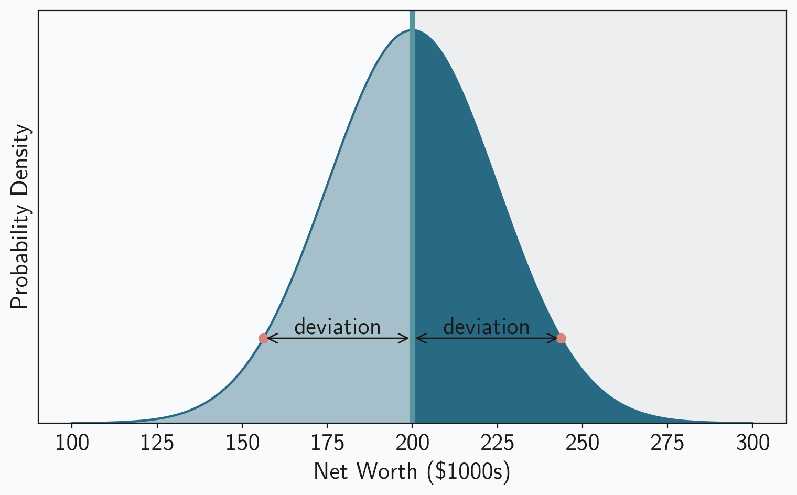
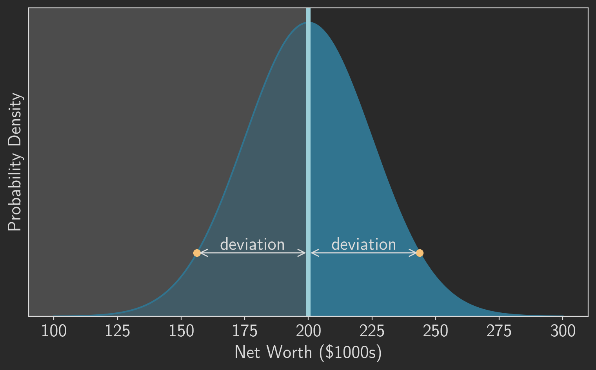
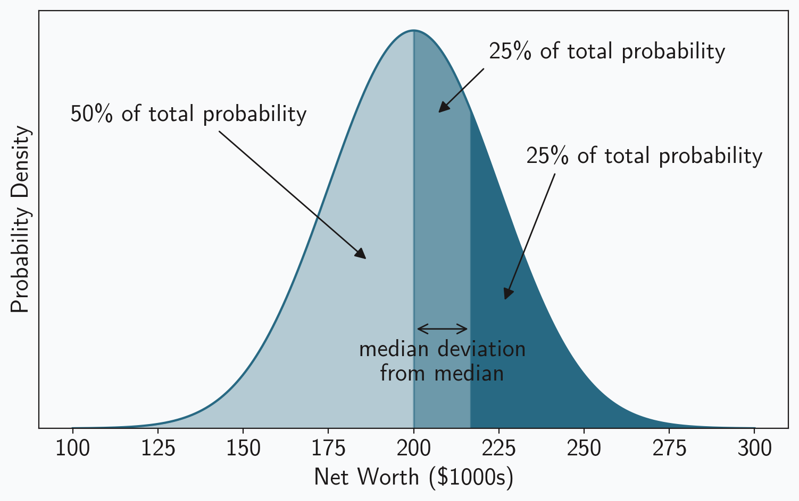
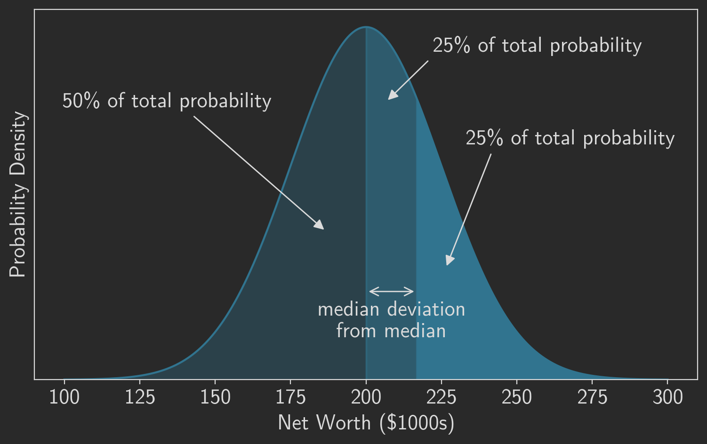
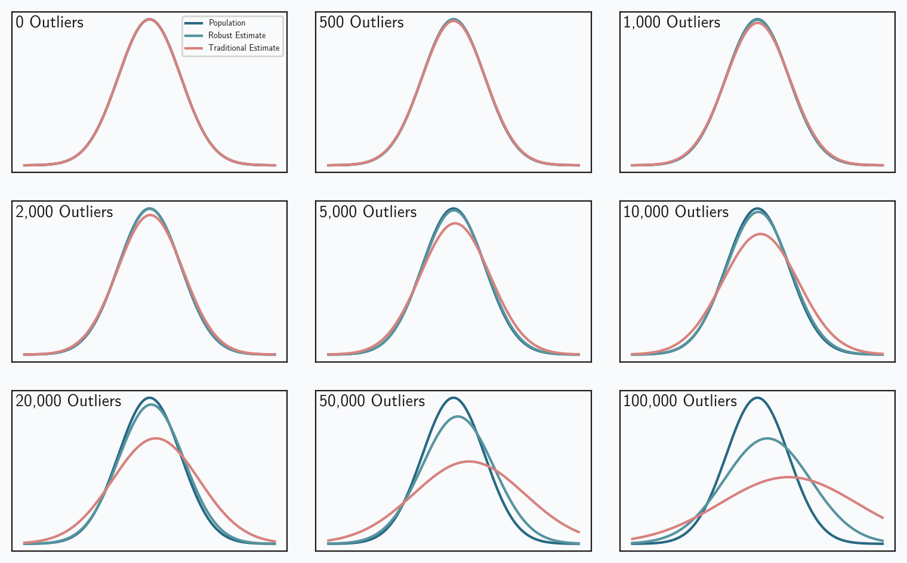
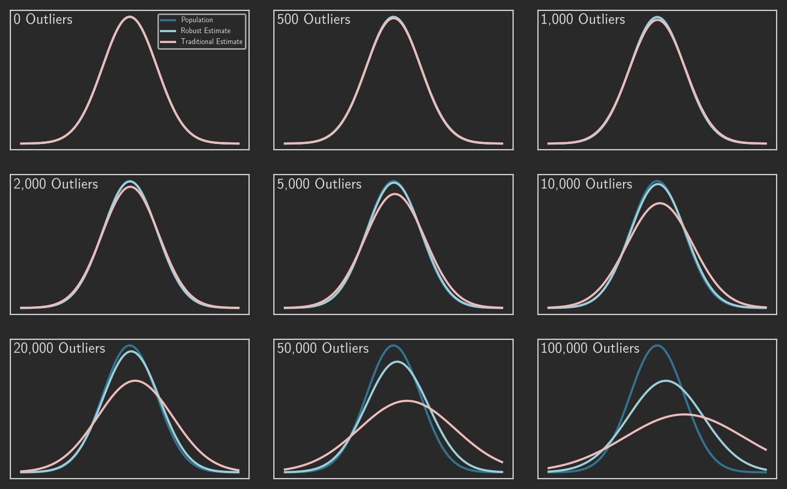

Even if you’ve forgotten everything else about statistics, mean and standard deviation are probably familiar. Both measures describe important characteristics of a numerical data set. The mean gives us a sense of the “average” or “typical” value of the data, and the standard deviation tells us how widely values vary from that average. Sometimes, however, those two measures don’t work as well as we would like. If a data set has been contaminated with even a few outliers, for example, both the mean and the standard deviation can be misleading. And in those cases, robust statistics provide alternatives that may better describe the data. In this article, we’ll look at a concrete example of the problems with traditional measures, we’ll see how robust statistics solve those problems, and we’ll consider ways to relate robust measures with traditional ones.

## Mean and Standard Deviation are Sensitive to Outliers

To see how mean and standard deviation can fall short, consider this simple example: Imagine a population of people whose net worth follows a normal distribution with a mean of \$200,000 and a standard deviation of \$25,000<label for="sn-1" class="sidenote-toggle sidenote-number"></label>
<input type="checkbox" id="sn-1" class="sidenote-toggle" />
<span class="sidenote">Although the distribution of net worth in the United States is far from a normal distribution, its median value in 2023 was about \$200,000 according to the Federal Reserve's <a src="https://www.federalreserve.gov/econres/scfindex.htm">Survey of Consumer Finance</a>. So this imaginary population at least bears a superficial resemblence to the <abbr>US</abbr> population.</span>. Pick fifty random inviduals from this population, and describe that sample using statistics. We can simulate that experiment in software.

```python
import numpy as np
np.random.seed(42)

population_mean = 200000
population_stdev = 25000

group = np.random.normal(loc=population_mean, scale=25000, size=50)

mean = np.mean(group)
stdev = np.std(group)
```

The mean net worth of this sample is about \$194,000, and its standard deviation is about \$23,000. Both of these values are consistent with the whole population. If those measures were the only information you had about a group of fifty people, you would have no reason to doubt that the group’s members were typical folks from the population.

Now imagine that a single billionaire joins the group. How does that addition affect these measures?

```python
newgroup = np.append(group, 1000000000)
mean = np.mean(newgroup)
stdev = np.std(newgroup)
```

The group’s mean net worth has now grown to nearly \$20 million! This new group looks like a gathering of multi-millionaires, not at all typical of the general population. The group’s standard deviation, now over \$138 million, also differs substantially from the population’s \$23 thousand. Based solely on the mean and standard deviation, we would never suspect that there is nothing special about 50 of the group’s 51 members. The traditional measures could mislead us to the wrong conclusion.

## Robust Measures Limit the Effects of Outliers

If we suspect that a data set contains outliers that don’t represent the population, we may want to limit the effects of those extreme values in our analysis. Robust statistics are one way to do that. The robust alternatives to the mean and standard deviation are the _median_ and the _median absolute deviation_ (<abbr>MAD</abbr>). Here is what those measures say about our example. First, consider the original 50 folks without the billionaire.

```python
from scipy import stats

median = np.median(group)
mad = stats.median_abs_deviation(group, scale="normal")
```

The median net worth of our original group is \$194,146 and its <abbr>MAD</abbr><label for="sn-2" class="sidenote-toggle sidenote-number"></label>
<input type="checkbox" id="sn-2" class="sidenote-toggle" />
<span class="sidenote">More precisely, the code example calculates the normalized <abbr>MAD</abbr>, which corresponds to the standard deviation for normally-distributed populations. We’ll look at that in more detail below.</span> is \$22,009. Those measures reasonably reflect the characteristics of the entire population with its mean of \$200,000 and standard deviation of \$25,000. But what happens when the billionaire arrives?

```python
median = np.median(newgroup)
mad = stats.median_abs_deviation(newgroup)
```

The median net worth only increases to \$194,147, and the new <abbr>MAD</abbr> is \$22,604. One outlier doesn’t change the measures much at all, and, by those values, the new group still reflects the general population.

Calculating these robust measures is straightforward. For the median, arrange the data in order and pick the value exactly in the middle. Once the median is known, determine the <abbr>MAD</abbr> by first calculating the absolute values of the differences between each data value and the median, and then find the median of the result. That’s probably easier to understand with an example:

1. Data set: `[3, 1, 10, 5, 7]`
2. Data set in order:  `[1, 3, 5, 7, 10]`
3. Median is central (third) value: `5`
4. Deviations from median in original data set: `[-2, -4, 5, 0, 2]`
5. Absolute deviations: `[2, 4, 5, 0, 2]`
6. Absolute deviations in order: `[0, 2, 2, 4, 5]`
7. Median absolute deviation is central (third) value: `2`

## Sometimes Robust Measures can Match Traditional Measures 

In the example above, we were able to compare the sample’s median and <abbr>MAD</abbr> (194,000 and 22,600) to the population’s mean and standard deviation (200,000 and 25,000). The result suggested that the sample was indeed from the population. To make this comparison, however, we had to rely on an extra calculation that note 2 hints at: we had to normalize the <abbr>MAD</abbr>. It’s not shown in the procedure shown above, so let’s add it now.

8. Optionally, and if possible, scale the median and/or the <abbr>MAD</abbr>

To scale a robust measure, we multiply its raw value by a scaling factor. This additional multiplication makes the robust measure directly comparable with its non-robust equivalent. In our example, the raw <abbr>MAD</abbr> for the original group is 14,845. That’s not very close to the population’s standard deviation of 25,000 or the sample’s standard deviation of 23,107. It’s when we multiply that raw value by 1.4826 that we get the normalized <abbr>MAD</abbr> of 22,009 which we can compare to both. 

There are two important qualifiers in step 8. The first is “optionally.” It’s not always necessary that robust measures correspond to traditional ones. Unscaled robust measures are a perfectly legitimate way to describe data. Nonetheless, mean and standard deviation are more common, so scaling robust measures to match traditional ones can make an analysis easier to understand and appreciate, especially by folks unfamiliar with robust statistics. The second qualifier adds a warning though: that’s not always possible. You can scale robust measures for some data, but nor for all data. It depends on the probability distribution of the underlying population. Our example follows a normal distribution, and the normal distribution supports scaling. That’s all we’ll consider in this post, but a follow up will look at other distributions where things get tricky.

The mathematics behind the scaling of robust statistics are not super complicated. Even so, I find the process easier to understand visually, so that’s the approach I’ll use here. In a few graphs we can see how scaling works and, in particular, how to derive the magic value of 1.4826.

In many cases, including our example, the mean/median relationship is trivial: they’re the same. This is true whenever the distribution is symmetric about the mean, including for the normal distribution we’ve been using in our example. You can see that graphically in figure 1, which plots the probability density for our example population. Half of the density lies below the mean and half lies above it, so the mean must be exactly in the middle. Of course, the “middle” is, by definition, the median. So in this case we can consider the median to be the “robust mean.”

<figure>





<figcaption>The probability density function (<abbr>PDF</abbr>) of the normal distribution shows that the mean lies exactly in the middle; that is exactly the definition of the <em>median,</em> and for this distribution, the two measures have the same expected value.</figcaption></figure>

The situation is more complicated for the <abbr>MAD</abbr> and the standard deviation. They’re clearly not equal, even in our example, as the population standard deviation was \$25,000 while the sample <abbr>MAD</abbr> of the original group was only \$14,845. You can’t directly compare those numbers. It turns out, however, that all we need is a constant scaling factor to make the two values comparable. Let’s find that scaling factor. Remember that the <abbr>MAD</abbr> is defined as the median of absolute deviations. We’ve already seen that the median equals the mean, $\mu$.

$$
\small{\text{MAD}}(X) = \text{median}(\left| X_i - \text{median}(X) \right|) = \text{median}(\left| X_i - \mu) \right|)
$$

The symmetry of the normal distribution helps here as well. Notice that the absolute deviations can be split into two groups: (1) the deviation for values greater than the mean, $X_i - \mu$, and (2) the deviation for values less than the mean, $\mu - X_i$. But, as figure 2 shows, those two groups have the same absolute deviations; for every point that’s greater than the mean, there is an equivalent point less than the mean with the same absolute deviation. And since each group has the same absolute deviations, each group will also have the same median value for those absolute deviations. Deriving the median for one of the groups is enough to tell us the <abbr>MAD</abbr> of the entire distribution.

<figure>





<figcaption>For the normal distribution, every point below the mean/median has a corresponding point above the mean/median with the same deviation.</figcaption>

</figure>

Just like the median is the point exactly in the middle of the probability density, the median deviation from that median is the point exactly in the middle of the upper half of the probability density. It is point at which half of the probability lies to its left and half lies to its right. Figure 3 highlights these divisions. As the figure shows, we first divide the probability density in half to find the median, and then we divide one of those halves in half again to find the median deviation.

<figure>





<figcaption>The area of the <abbr>PDF</abbr> above the mean/median represents half of the total probability. Dividing that region in half again locates the median deviation from the mean/median.</figcaption>

</figure>

One we see where the median deviation is located, it’s easy to calculate. The value, in this case net worth, is the 75th percentile value for our distribution. And the median absolute deviation is the difference between that value and the median value or the population mean. In our example the expected value for the <abbr>MAD</abbr> is \$16,862,

```python
percentile75 = population.ppf(0.75)
mad = percentile75 - population_mean
```

The same approach works for any normal distribution. The expected value of the median is the population mean, and the expected value of the <abbr>MAD</abbr> is the difference between the 75th percentile and the mean.

$$
\begin{aligned}
\text{median}\left[X \sim N(\mu,\sigma)\right] &= \mu \\
\small{\text{MAD}}\left[X \sim N(\mu,\sigma)\right] &= \text{P}_{0.75}(X) - \mu
\end{aligned}
$$

To make the relationship between <abbr>MAD</abbr> and $\sigma$ more concrete, use the formula for percentile values of the normal distribution. It depends on both $\mu$ and $\sigma$ as well as values of the probit function $\Phi^{-1}$. Equation 3 shows the results: the expected value of <abbr>MAD</abbr> is linearly proportional to the standard deviation, and the scaling constant is $\Phi^{-1}(0.75)$.

$$
\begin{aligned}
\small{\text{MAD}}\left[X \sim N(\mu,\sigma)\right] &= \text{P}_{0.75}(X) - \mu \\
&= \left[\mu + \sigma \ {\Phi}^{-1}(0.75)\right] - \mu \\
&= \sigma \ \Phi^{-1}(0.75) \\
\text{or} \\
\sigma &= \dfrac{\small{\text{MAD}}}{\Phi^{-1}(0.75)}
\end{aligned}
$$

No simple expression exists for the probit funtion $\Phi^{-1}(p)$ in general, but its value at 0.75 can be computed analytically and is approximately 0.67449. If we measure the <abbr>MAD</abbr> of a sample from a normally distributed population, we can expect the population’s standard deviation to equal that measurement divided by 0.67449. This value is sometimes called the _normalized median absolute deviation,_ and it serves as a robust version of the standard deviation for normal distributions. Some programming libraries (e.g. [R stats](https://www.rdocumentation.org/packages/stats/versions/3.6.2/topics/mad)) even employ this scaling by default when computing the median absolute deviation; they’re assuming, by default, that the population is normal.

Now we have a way to provide robust descriptive statistics that are directly comparable to to traditional measures, at least for normally distributed populations:

$$
\begin{aligned}
\mu &\sim \text{median} \\
\sigma &\sim 1.4826 \cdot \small{\text{MAD}}
\end{aligned}
$$

## Robust Measures can be Effective with Many Outliers

Now that we have a way to calculate robust versions of the mean and standard deviation, we can see how well those measures resist outliers. Recall that our original group was sampled from a normal distribution with $\mu = 200{,}000$ and $\sigma = 25{,}000$, and we added one outlier to that group. The mean and standard deviation of the new group were nearly 20,000,000 and 138,000,000, respectively. Those measures aren’t even close to the distribution parameters. The robust measures, however, reflect the population quite nicely: 194,000 and 22,600 for the “robust mean” and “robust standard deviation”. At least for our initial example, robust statistics provide a better description of the underlying population when the sample includes outliers.

To verify that this result isn’t a fluke, we can generate a series of samples from normal distributions with a range of parameters, introduce outliers into those samples, and compare traditional and robust measures.

```python
np.random.seed(42)
sample_stats = []
for mu in [1, 10, 100]:
    for sigma in [x * mu for x in [0.1, 0.2, 0.5, 1, 2, 5, 10]]:
        sample = np.random.normal(loc=mu, scale=sigma, size=500000)
        sample[0:500] = [mu + 5 * sigma] * 500 # replace some samples with outliers
        sample_stats.append({
            'mu': mu,
            'mean': np.mean(sample),
            'median': np.median(sample),
            'sigma': sigma,
            'std': np.std(sample),
            'mad': stats.median_abs_deviation(sample, scale="normal")
        })
```

Table 1 lists the results. As it makes clear, the robust measures consistently provide substantially more accurate estimates of the true population parameters.

: Comparison of traditional and robust measures for multiple samples from various normal distributions. Each row summarizes 499,500 values randomly sampled from a distribution, combined with 500 values set to <em>μ</em> + 5<em>σ</em>. Note that <abbr>MAD</abbr> is the <em>normalized</em> median absolute deviation.

| $\mu$ |    mean |   median | $\sigma$ |      std | <abbr>MAD</abbr> |
| :---: | ------: | -------: | :------: | -------: | ---------------: |
|   1   | 1.00038 |  1.00003 |   0.1    | 0.101241 |         0.100256 |
|   1   |  1.0006 |  1.00006 |   0.2    | 0.202366 |         0.200352 |
|   1   | 1.00184 | 0.999959 |   0.5    | 0.507097 |         0.501442 |
|   1   | 1.00575 |  1.00302 |    1     |  1.01217 |         0.999266 |
|   1   | 1.01241 |  1.00631 |    2     |  2.02585 |          2.00451 |
|   1   | 1.02055 |  1.00661 |    5     |   5.0526 |          5.00356 |
|   1   | 1.05392 |  1.00601 |    10    |  10.1104 |          9.99765 |
|  10   | 10.0058 |   9.9996 |    1     |  1.01116 |          1.00149 |
|  10   | 10.0107 |  10.0073 |    2     |  2.02504 |          2.00467 |
|  10   | 10.0243 |  10.0064 |    5     |  5.05805 |          5.01062 |
|  10   | 10.0504 |  9.99848 |    10    |  10.1241 |          10.0024 |
|  10   |  10.055 |  10.0042 |    20    |  20.2442 |          20.0376 |
|  10   | 10.3353 |  10.1176 |    50    |  50.5643 |          50.0471 |
|  10   | 10.6621 |  10.1211 |   100    |  101.178 |          100.086 |
|  100  | 100.048 |  100.012 |    10    |  10.1221 |          10.0404 |
|  100  | 100.117 |  100.019 |    20    |  20.2282 |          20.0061 |
|  100  | 100.172 |  99.9882 |    50    |  50.6538 |           50.147 |
|  100  |  100.61 |   100.39 |   100    |  101.193 |           100.27 |
|  100  | 100.709 |  100.164 |   200    |  202.234 |          200.081 |
|  100  | 102.727 |  101.292 |   500    |  505.394 |          499.636 |
|  100  | 102.913 |  99.9615 |   1000   |  1012.84 |          1001.87 |

We can also visualize the performance differences between estimators. Figure 4 looks at 500,000 random samples from a standard normal population ($\mu$ = 0, $\sigma$ = 1). The data set in each panel is contaminated with an increasing number of outliers. The plots compare three probability density functions:

1. The true <abbr>PDF</abbr> of the population.
2. The <abbr>PDF</abbr> based on traditional estimates of the population parameters.
3. The <abbr>PDF</abbr> based on robust estimates of the population.

One again, the robust measures more accurately reflect the true population.

<figure>





<figcaption>The true <abbr>PDF</abbr> of a normal distribution compared with estimated <abbr>PDF</abbr>s based on traditional and robust measures. Plots derived from sampled data sets consisting of 500,000 random samples corrupted with an increasing number of outliers.</figcaption>

</figure>

These results are pretty impressive, but they do come with an important caveat: we’re considering a population represented by the normal distribution. The next post will examine the complications that different distributions introduce.

## Colophon

Figures 1-3 were created by the following code:

```python
from matplotlib import font_manager, pyplot as plt

# Define the range for the x-axis
x = np.linspace(
    population_mean - 4 * population_stdev, population_mean + 4 * population_stdev, 1000
)

# Compute the PDF of the normal distribution
population = stats.norm(population_mean, population_stdev)
pdf = population.pdf(x)

# Plot styles
%config InlineBackend.figure_format = 'retina'
font_dir = ["../Fonts"]
for font in font_manager.findSystemFonts(font_dir):
    font_manager.fontManager.addfont(font)

darkmode = True
plottype = "topmedian" # median, deviation, topmedian

plt.style.use('../Styles/darkmode.mplstyle' if darkmode else '../Styles/lightmode.mplstyle')

color1 = plt.rcParams["axes.prop_cycle"].by_key()["color"][0]
color2 = plt.rcParams["axes.prop_cycle"].by_key()["color"][1]
color3 = plt.rcParams["axes.prop_cycle"].by_key()["color"][2]
color4 = plt.rcParams["axes.prop_cycle"].by_key()["color"][3]
color5 = plt.rcParams["axes.prop_cycle"].by_key()["color"][4]
color6 = plt.rcParams["axes.prop_cycle"].by_key()["color"][5]
textcolor = plt.rcParams["text.color"]

#--- Figure created in layers
fig, ax = plt.subplots(figsize=(7.88, 5), tight_layout=True)

#--- shading of region divided by mean
if plottype in ("median", "deviation"):
    if darkmode:
        ax.add_patch(plt.Rectangle(
            (0, 0), 0.5, 1, facecolor=textcolor, alpha=0.20, transform=ax.transAxes
        ))
    else:
        ax.add_patch(plt.Rectangle(
            (0.5, 0), 0.5, 1, facecolor=textcolor, alpha=0.05, transform=ax.transAxes
        ))

#--- PDF itself
ax.plot(x, pdf)
ax.set_xlabel("Net Worth ($1000s)")
ax.xaxis.set_major_formatter(lambda x, pos: f'{x/1000:.0f}')
ax.set_ylabel("Probability Density")

# disable y ticks and tick labels
ax.tick_params(
    axis="y",
    which="both",
    left=False,
    right=False,
    labelleft=False,
)

# remove the bottom margin but retain the top margin
ax.set_ymargin(0)
ax.autoscale_view()
lim = ax.get_ylim()
delta = np.diff(lim)
top = lim[1] + delta * 0.05
bottom = lim[0]
ax.set_ylim(bottom, top)

#--- fill the area beneath the curve
if plottype in ("median", "deviation"):
    plt.fill_between(x[: len(x) // 2], pdf[: len(pdf) // 2], color=color1, alpha=0.33)
    plt.fill_between(x[len(x) // 2 :], pdf[len(pdf) // 2 :], color=color1)
elif plottype == "topmedian":
    x0 = population_mean
    x1 = population.ppf(0.75)
    i50plus = [i for i in range(len(x)) if x0 <= x[i] < x1]
    i75plus = [i for i in range(len(x)) if x[i] >= x1]
    plt.fill_between(x[: len(x) // 2], pdf[: len(pdf) // 2], color=color1, alpha=0.33)
    plt.fill_between(x[i50plus], pdf[i50plus], color=color1, alpha=0.67)
    plt.fill_between(x[i75plus], pdf[i75plus], color=color1)

#--- label the regions

if plottype == "median":
    ax.text(
        0.525,
        0.98,
        "Half of density above mean",
        transform=ax.transAxes,
        verticalalignment="top",
        horizontalalignment="left",
    )
    ax.text(
        0.475,
        0.98,
        "Half of density below mean",
        transform=ax.transAxes,
        verticalalignment="top",
        horizontalalignment="right",
    )

#--- highlight the mean value
if plottype in ("median", "deviation"):
    ax.axvline(
        population_mean,
        linewidth=4,
        color=color2,
    )
if plottype == "median":
    ax.annotate(
        "mean",
        xy=(0.5, 0.4),
        xytext=(0.45, 0.4),
        arrowprops=dict(facecolor=textcolor, arrowstyle='-|>'),
        horizontalalignment="right",
        verticalalignment="center",
        xycoords=ax.transAxes
    )

#--- add example deviations
if plottype == "deviation":
    x0 = population_mean
    y0 = population.pdf(x0)
    x1 = population_mean - 1.75 * population_stdev
    y1 = population.pdf(x1)
    x2 = population_mean + 1.75 * population_stdev
    y2 = population.pdf(x2)
    plt.scatter(x1, y1, color=color4, zorder=2.5)
    plt.scatter(x2, y2, color=color4, zorder=2.5)
    ax.annotate(
        "deviation",
        xy=(x0,y1),
        xytext=(x1 + (x0-x1)/2, y1),
        horizontalalignment="center",
        verticalalignment="bottom"
    )
    ax.annotate(
        "",
        xy=(x0,y1),
        xytext=(x1,y1),
        arrowprops=dict(facecolor=textcolor, arrowstyle="<->")
    )
    ax.annotate(
        "deviation",
        xy=(x0,y2),
        xytext=(x2 - (x2-x0)/2, y2),
        horizontalalignment="center",
        verticalalignment="bottom"
    )
    ax.annotate(
        "",
        xy=(x0,y2),
        xytext=(x2,y2),
        arrowprops=dict(facecolor=textcolor, arrowstyle="<->")
    )

#--- label regions of probability
if plottype == "topmedian":
    ax.annotate(
        "50% of total probability",
        horizontalalignment="center",
        verticalalignment="center",
        xy=(0.44,0.4),
        xytext=(0.2,0.75),
        xycoords=ax.transAxes,
        arrowprops=dict(facecolor=textcolor, arrowstyle='-|>', relpos=(0.55,0.5))
    )
    ax.annotate(
        "25% of total probability",
        horizontalalignment="left",
        verticalalignment="center",
        xy=(0.53,0.75),
        xytext=(0.6,0.9),
        xycoords=ax.transAxes,
        arrowprops=dict(facecolor=textcolor, arrowstyle='-|>', relpos=(0.05,0.5))
    )
    ax.annotate(
        "25% of total probability",
        horizontalalignment="left",
        verticalalignment="center",
        xy=(0.62,0.3),
        xytext=(0.65,0.65),
        xycoords=ax.transAxes,
        arrowprops=dict(facecolor=textcolor, arrowstyle='-|>', relpos=(0.15,0.5))
    )
    x0 = population_mean
    y = 0.25 * population.pdf(x0)
    x1 = population.ppf(0.75)
    ax.annotate(
        "median deviation\nfrom median",
        xy=(x0,y),
        xytext=(x1 + (x0-x1)/2, y*0.9),
        horizontalalignment="center",
        verticalalignment="top"
    )
    ax.annotate(
        "",
        xy=(x0,y),
        xytext=(x1,y),
        arrowprops=dict(facecolor=textcolor, arrowstyle="<->")
    )

plt.show()
```

The code below was used to create figure 4.

```python
np.random.seed(42)

x = np.linspace(-4, 4, 1000)

fig, axs = plt.subplots(3, 3, figsize=(7.88, 5), tight_layout=True)

for index, num_outliers in enumerate([0, 500, 1000, 2000, 5000, 10000, 20000, 50000, 100000]):

    sample = np.random.normal(loc=0, scale=1, size=500000)
    sample[0:num_outliers] = [5] * num_outliers # replace some samples with outliers
    mean = np.mean(sample)
    median = np.median(sample)
    std = np.std(sample)
    mad = stats.median_abs_deviation(sample, scale="normal")
    
    pdf = stats.norm(0, 1).pdf
    est_pdf = stats.norm(mean, std).pdf
    robust_pdf = stats.norm(median, mad).pdf

    ax = axs[index // 3, index % 3]

    ax.plot(x, pdf(x), label="Population")
    ax.plot(x, robust_pdf(x), label="Robust Estimate")
    ax.plot(x, est_pdf(x), label="Traditional Estimate")
    ax.tick_params(
        axis="x",
        which="both",
        top=False,
        bottom=False,
        labelbottom=False,
    )
    ax.tick_params(
        axis="y",
        which="both",
        left=False,
        right=False,
        labelleft=False,
    )
    ax.text(
        0.0125,
        0.975,
        f'{num_outliers:,} Outliers',
        transform=ax.transAxes,
        verticalalignment="top",
        horizontalalignment="left",
        fontsize=10
    )
    if (index == 0):
        ax.legend(fontsize=5)

plt.show()
```

