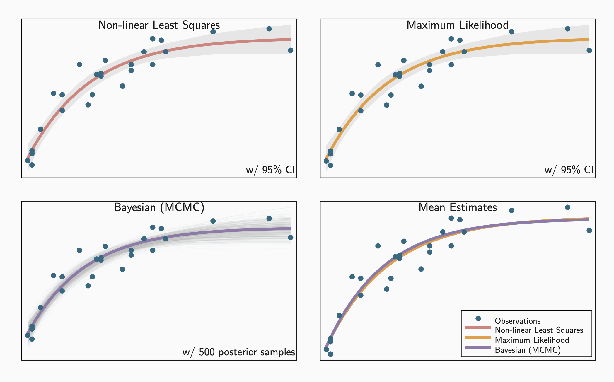

As a last “warm up” post, I’ll share some notes on using the [Stata](https://www.stata.com) application for general statistical modeling. It might be the only time stata code appears on the blog since most of my programming relies on other environments. But Stata is a really handy application for quickly analyzing data. In the vast majority of cases it’s possible to perform an analysis only with the graphical user interface, so there’s no need to learn (or remember) yet another language syntax. To make it more convenient, Stata also saves every <abbr>GUI</abbr> interaction as a command, so you can reliably reproduce your results later. And, of course, as first class statisical software, it is substantially more powerful than general purpose applications such as Excel.

A practice I hope to perpetuate in this blog is including all the code for each post, not just snippets. That not only helps readers reproduce the results, but it ensures that _I_ can reproduce them as well. Here is the initialization code that I typically use for all Stata scripts<label for="sn-1" class="sidenote-toggle sidenote-number"></label>
<input type="checkbox" id="sn-1" class="sidenote-toggle" />
<span class="sidenote">Experienced Stata users will note that I do not follow the normal convention of abbreviating commands and options. I find code much less confusing when they are spelled out in full.</span>. The `version` command is one of my favorites. It directs Stata to execute the remainder of the script as if it were the specified Stata version. In this case I’m using version 18. In the future when newer Stata versions are available, this command will tell the application not to use updated versions of alogrithms and equations. This feature is a big help for reproducibility.

```stata
version 18          // Stata version used to create/execute this script
set more off        // disable pause of output display every full screen
clear all           // ensure clean slate
capture log close   // close any pending logs
set seed 123456789  // consistent random number generation
```

For all of the analysis we’ll reuse a commonly cited [example](https://chjackson.github.io/openbugsdoc/Examples/Dugongs.html) from the now-retired OpenBUGS software. The data are length and age measurements for 27 captured dugongs (sea cows)<label for="sn-2" class="sidenote-toggle sidenote-number"></label>
<input type="checkbox" id="sn-2" class="sidenote-toggle" />
<span class="sidenote">Ratkowsky, David A.. _Nonlinear Regression Modeling: A Unified Practical Approach._ Switzerland, M. Dekker, 1983.</span>. Carlin and Gelfand (1991)<label for="sn-3" class="sidenote-toggle sidenote-number"></label><input type="checkbox" id="sn-3" class="sidenote-toggle" /><span class="sidenote">Carlin, B. P., and A. E. Gelfand. “An iterative Monte Carlo method for nonconjugate Bayesian analysis.” _Statistics and Computing,_ vol. 1, no. 2, Dec. 1991, pp. 119–28. Scopus, doi:10.1007/BF01889986.</span> model the data from this example using a simple nonlinear growth curve that increases rapidly at early ages and tends to an asymptote as the age increases. In simple form, $y = \alpha - \beta \cdot \lambda^x$, where $y$ starts at $\alpha - \beta$ when $x = 0$ and, provided $\lambda < 1$, asymptotically approaches $\alpha$. Equation 1 describes the model more formally; in particular we assume that any errors in the data are normally distributed with zero mean and an unknown standard deviation.
$$
y \sim \alpha - \beta \cdot \lambda^x + \text{N}(0, \sigma^2)
$$
We’ll use that same model for all the examples that follow. As a check for the results that we get from Stata, a simple. model in [Stan](https://mc-stan.org) provides what I consider the “gold standard” for estimates of model parameters. Table 1 details the parameter estimates from this model.

```stan
data {
        int<lower=0> N;
        array[N] real<lower=0> x;
        array[N] real<lower=0> y;
    }
    parameters {
        real alpha;
        real beta;
        real<lower=.5, upper= 1> lamda;
        real<lower=0> sigma;
    }
    transformed parameters {
        array[N] real m;
        for (i in 1:N)
            m[i] = alpha - beta * pow(lamda, x[i]);
    }
    model {
        // priors
        alpha ~ normal(0.0, 1000);
        beta  ~ normal(0.0, 1000);
        lamda ~ uniform(0.5, 1);
        sigma ~ inv_gamma(0.01, 0.01);

        // likelihood
        y ~ normal(m, sigma);
    }
```

: Parameter estimates from Stan

|        | Mean  | MCSE       | StdDev | 5%    | 50%   | 95%  |
| ------ | ----- | ---------- | ------ | ----- | ----- | ---- |
| alpha  | 2.7   | 3.5×10^-3^ | 0.069  | 2.6   | 2.6   | 2.8  |
| beta   | 0.97  | 3.2×10^-3^ | 0.072  | 0.85  | 0.97  | 1.1  |
| lambda | 0.86  | 1.6×10^-3^ | 0.031  | 0.81  | 0.87  | 0.91 |
| Sigma  | 0.099 | 7.2×10^-4^ | 0.015  | 0.078 | 0.097 | 0.12 |

Now we can turn to Stata. For reproducibility I’ll show the full data set as it’s loaded into Stata.

```stata
quietly {
    input x y
         1    1.8
         1.5  1.85
         1.5  1.87
         1.5  1.77
         2.5  2.02
         4    2.27
         5    2.15
         5    2.26
         7    2.47
         8    2.19
         8.5  2.26
         9    2.4
         9.5  2.39
         9.5  2.41
        10    2.5
        12    2.32
        12    2.32
        13    2.43
        13    2.47
        14.5  2.56
        15.5  2.65
        15.5  2.47
        16.5  2.64
        17    2.56
        22.5  2.7
        29    2.72
        31.5  2.57
    end
}
```

The Stata algorithms need initial guesses for the model parameters, so here’s what we’ll use. We could theoretically pick any values here, but the code will run much quicker if the guesses are at least in the ball park.

```stata
local alpha = 1
local beta  = 1
local lamda = 0.9
```

## Non-Linear Least Squares

A simple approach for finding parameter values is non-linear least squares with Stata’s `nl` command. It makes assumptions that are not always appropriate (e.g. errors are normally distributed) but even when those assumptions don’t hold, the approach may be helpful as a first step. The `nl` results can provide good initial values and, e.g., estimates for the error variance. The simplest way to use `nl` is with expressions.

```stata
nl (y = {alpha} - {beta} * {lamda} ^ x), ///
    initial(alpha `alpha' beta `beta' lamda `lamda') ///
    nolog
```

Although not necessary for this example, more complicated models may be implemented as "programs."

Stata requires programs used for non-linear least squares to have a name that starts with "nl". That prefix is then omitted when the program is referenced in the actual `nl` command.

```stata
capture program drop nlgrowth
program define nlgrowth
    syntax varlist(min=2 max=2) if, at(name)
    local y: word 1 of `varlist'
    local x: word 2 of `varlist'
    tempname alpha beta lamda
    scalar `alpha' = `at'[1, 1]
    scalar `beta'  = `at'[1, 2]
    scalar `lamda' = `at'[1, 3]
    replace `y' = (`alpha' - `beta' * `lamda' ^ `x') `if'
end

nl growth @ y x, ///
    parameters(alpha beta lamda) ///
    initial(alpha `alpha' beta `beta' lamda `lamda') ///
    nolog

local alpha_nl = _b[/alpha]
local beta_nl  = _b[/beta]
local lamda_nl = _b[/lamda]
```

Least squares provides reasonable estimate of the error variance. This estimate can be helpful in other methods (e.g. maximum likelihood and bayes), so we’ll save it.

```stata
// σ² ≈ MSE = RSS / (n - p)
local sigma = sqrt(e(rss) / (_N - 2))
```

One benefit of `nl` is the ability to use `predictnl` to generate new variables based on the parameters. Note, though, that we can only do this if the model can be written as an expression in addition to or instead of a program. That's the case here. As an option, we can also ask for confidence intervals.

```stata
quietly predictnl pred_nl = (_b[/alpha] - _b[/beta] * _b[/lamda] ^ x), ///
    ci(low_nl high_nl)
```

## Bayesian (MCMC)

For a completely different approach, we can use Bayesian analysis to parameterize our model. As with non-linear regression, Stata can do that easily; all it needs is the expression corresponding to our model as well as our prior probabilities. We’ll use standard non-informative priors and the same initial guesses as above.

```stata
bayesmh y = ({alpha} - {beta} * {lamda} ^ x), ///
    likelihood(normal({var})) ///
    prior({alpha beta}, normal(0, 1000)) ///
    prior({lamda}, uniform(0.5, 1)) ///
    prior({var}, igamma(0.1, 0.1)) ///
    initial({alpha} `alpha' {beta} `beta' {lamda} `lamda' {var} `sigma'^2)
```

For more complicated models, we can use a custom "program evaluator." We can use a log-likelihood evaluator instead of a log-posterior evaluator because we're okay using built-in distributions as priors for the parameters.

Our model has no linear combinations for the independent variable $x$, so ideally we would just define a constraint that fixed the slope. Currently the `bayesmh` command doesn't allow constraints with program evaluators, though. To work around that and avoid any spurious warnings for variables that we don't use, we pass `x` as an extra variable instead. Here’s a program evaluator for our example.

```stata
capture program drop growth_lleval
program define growth_lleval
    // Arguments:
    //   lnden: the name of a temporary scalar to be filled in with an overall
    //          log-likelihood value
    //   alpha, beta, lamda, sigma: model parameters (not linear equations)
    args lnden alpha beta lamda sigma

    // Make the code a little bit more readable with clearer references
    local x "$MH_extravars"
    local y "$MH_y"

    tempvar lnfj
    quietly generate double `lnfj' = ///
        lnnormalden(`y', (`alpha' - `beta' * `lamda' ^ `x'), `sigma') ///
        if $MH_touse

    summarize `lnfj', meanonly

    // If there was a problem, don't report an actual result but return a
    // missing value instead. This is the Stata convention. To detect problems
    // we ensure that the number of generated values is the same as the number
    // of observations.
    if r(N) < $MH_n {
        scalar `lnden' = .
        exit
    }

    scalar `lnden' = r(sum)
end
```

And here’s how we use that program to estimate posterior parameter values.

```stata
// Bayes results include the MCMC posteriors and require significantly more
// storage space. Use a temporary file to hold them.
tempfile bayes_file

bayesmh y, noconstant ///
    llevaluator( ///
        growth_lleval, ///
        extravars(x) ///
        parameters({alpha} {beta} {lamda} {sigma}) ///
    ) ///
    prior({alpha beta}, flat) ///
    prior({lamda}, uniform(0.5, 1)) ///
    prior({sigma}, igamma(0.01, 0.01)) ///
    initial({alpha} `alpha' {beta} `beta' {lamda} `lamda' {sigma} `sigma') ///
    saving(`bayes_file')

// For a simple comparison, save the mean values from the MCMC posterior
local alpha_bs = e(mean)[1, "alpha"]
local beta_bs  = e(mean)[1, "beta"]
local lamda_bs = e(mean)[1, "lamda"]
local sigma_bs = e(mean)[1, "sigma"]
local mcmc_samples = e(mcmcsize)
```

With the Bayesian approach, Stata lets us perform more extensive analyses. To do that, we can load the posterior data in a separate data frame. The resulting dataset will contain the parameter values realized in the MCMC chains. With a small bit of housekeeping, we can randomly sample from those posterior values. The final results include these samples as a way to visualize our model’s uncertainty as a Bayesian alternative to confidence intervals.

```stata
tempname posterior
frame create `posterior'
frame `posterior': use `bayes_file'
quietly frame `posterior' {
    expand _frequency
    keep eq*
    rename eq0_p1 alpha
    rename eq0_p2 beta
    rename eq0_p3 lamda
    rename eq0_p4 sigma
    generate double randu = runiform()
    isid randu
    sort randu
}
```

## Maximum Likelihood (ml) Estimation

Finally, Stata also support maximum likelihood estimates. As with our previous approaches, we can do that simply with a substitutable expression.

```stata
mlexp (lnnormalden(y, {alpha} - {beta} * {lamda} ^ x, {sigma})), ///
    from(alpha = `alpha' beta = `beta' lamda = `lamda' sigma = `sigma') ///
    difficult nolog

// The "predictnl" command also works after "mlexp"
quietly predictnl pred_ml = (_b[/alpha] - _b[/beta] * _b[/lamda] ^ x), ///
    ci(low_ml high_ml)
```

More complex problems may benefit from a complete "program."  To demonstrate that, we use the linear form for the maximum likelihood estimation, so this program is a "method-lf evaluator." Method-lf evaluators are required to evaluate the observation-by-observation log likelihood `ln(Lj), j = 1, …, N` where the subscript `j` indexes the observations. Because the model doesn't have any parameters that create linear functions of $x$ (i.e. no scale or location) we constrain the linear coefficient to be 1. We'll also force the constant term to be zero when we execute the `ml` command.

```stata
constraint define 1 [xb]:x = 1

capture program drop growth_lfeval
program define growth_lfeval
    // Arguments:
    //   lnfj: variable to be filled in with observation-by-observation
    //         values of ln(Lj)
    //   x: independent variable obtained via a linear equation where the
    //      slope is constrained to be 1 (above) and no constant is allowed
    //      (below)
    //   alpha, beta, lamda, sigma: model parameters (not linear equations)
    args lnfj x alpha beta lamda sigma

    // Get access to the dependent variable (y). This isn't strictly
    // necessary (and possibly degrades performance), but it makes the
    // expressions easier to read.
    local y $ML_y1

    quietly replace `lnfj' = ///
        lnnormalden(`y', (`alpha' - `beta' * `lamda' ^ `x'), `sigma') ///
        if $ML_samp == 1
end
```

This is non-interactive mode, so the `maximize` option is specified. We also specify `nopreserve` as good practice even though it has no effect for linearform (lf) methods. In general, it tells Stata to assume that the evaluator is correctly using `$ML_samp`; without that assumption Stata takes extra precautions that degrade performance.

```stata
ml model linearform growth_lfeval ///
    (xb: y = x, noconstant) ///
    (alpha:, freeparm) ///
    (beta:,  freeparm) ///
    (lamda:, freeparm) ///
    (sigma:, freeparm) ///
    , constraint(1) ///
    init(xb:x = 1 alpha = `alpha' beta = `beta' lamda = `lamda' sigma = `sigma') ///
    maximize search(off) difficult nolog nopreserve

local alpha_ml = _b[/alpha]
local beta_ml  = _b[/beta]
local lamda_ml = _b[/lamda]
local sigma_ml = _b[/sigma]
```

## The Results

Thankfully, all of the different modeling approaches yield similar results, as table 2 indicates. We can also compare the models by visualizing models based on the estimated parameters. Figure 1 shows that comparison. The final panel uses mean estimates from each approach to show all of them on a single plot.

: Stata results for multiple models compared to Stan estimates (with 95% confidence intervals or 95% credible sets)

|                      | $\alpha$          | $\beta$           | $\lambda$         |
| -------------------- | ----------------- | ----------------- | ----------------- |
| Stan                 | 2.7 [2.6, 2.8]    | 0.97 [0.85, 1.1]  | 0.86 [0.81, 0.91] |
| `nl` expression      | 2.66 [2.53, 2.79] | 0.96 [0.82, 1.11] | 0.87 [0.82 0.92]  |
| `nl` program         | 2.66 [2.53, 2.79] | 0.96 [0.82, 1.11] | 0.87 [0.82 0.92]  |
| `bayesmh` expression | 2.65 [2.49, 2.87] | 0.98 [0.79, 1.19] | 0.85 [0.75, 0.93] |
| `bayesmh` program    | 2.65 [2.54, 2.80] | 0.97 [0.80, 1.11] | 0.86 [0.80, 0.91] |
| `mlexp`              | 2.65 [2.54, 2.78] | 0.96 [0.83, 1.09] | 0.87 [0.82, 0.92] |
| `ml` program         | 2.65              | 0.96              | 0.87              |

```stata
gr_setscheme
local color1 `.__SCHEME.color.p1'
local color2 `.__SCHEME.color.p2'
local color3 `.__SCHEME.color.p3'
local color4 `.__SCHEME.color.p4'
local color5 `.__SCHEME.color.p5'
local color6 `.__SCHEME.color.p6'
local ciarea `.__SCHEME.color.ci_area'
local ciline `.__SCHEME.color.ci_line'

// One plot for each method separately to highlight that method's unique
// features, and then a combined plot to allow comparison of the results.

// Non-linear Least Squares - include confidence interval
twoway ///
    (rarea low_nl high_nl x, fcolor("`ciarea'") lwidth(none)) ///
    (function y = (`alpha_nl' - `beta_nl' * `lamda_nl' ^ x),  ///
        range(x) lcolor("`color3'") lwidth(1)) ///
    (scatter y x, mcolor("`color1'")), ///
    legend(off) ///
    title("Non-linear Least Squares", size(11pt) position(12) ring(0)) ///
    subtitle("w/ 95% CI", size(10pt) position(5) ring(0)) ///
    xtitle("") xlabel(none) ytitle("") ylabel(none) ///
    name(nl, replace) nodraw

// Maximum Likelihood - also with confidence interval
twoway ///
    (rarea low_ml high_ml x, fcolor("`ciarea'") lwidth(none)) ///
    (function y = (`alpha_ml' - `beta_ml' * `lamda_ml' ^ x),  ///
        range(x) lcolor("`color4'") lwidth(1)) ///
    (scatter y x, mcolor("`color1'")), ///
    legend(off) ///
    title("Maximum Likelihood", size(11pt) position(12) ring(0)) ///
    subtitle("w/ 95% CI", size(10pt) position(5) ring(0)) ///
    xtitle("") xlabel(none) ytitle("") ylabel(none) ///
    name(ml, replace) nodraw

// Bayesian - show plausible trajectories by sampling from the posterior
forvalues sample = 1/500 {
    local i = runiformint(1, `mcmc_samples')
    local a = _frval(`posterior', alpha, `i')
    local b = _frval(`posterior', beta,  `i')
    local l = _frval(`posterior', lamda, `i')
    local graph = "`graph' (function y = (`a' - `b' * `l' ^ x),"
    local graph = "`graph' range(x) lwidth(thin) lcolor(`ciline'%05))"
}

twoway ///
    `graph' ///
    (function y = (`alpha_bs' - `beta_bs' * `lamda_bs' ^ x),  ///
        range(x) lcolor("`color5'") lwidth(1)) ///
    (scatter y x, mcolor("`color1'")), ///
    legend(off) ///
    title("Bayesian (MCMC)", size(11pt) position(12) ring(0)) ///
    subtitle("w/ 500 posterior samples", size(10pt) position(5) ring(0)) ///
    xtitle("") xlabel(none) ytitle("") ylabel(none) ///
    name(bayes, replace) nodraw

// Summarized results on single plot - using mean values for parameters
twoway ///
    (function y = (`alpha_nl' - `beta_nl' * `lamda_nl' ^ x),  ///
        range(x) lcolor("`color3'") lwidth(1)) ///
    (function y = (`alpha_ml' - `beta_ml' * `lamda_ml' ^ x),  ///
        range(x) lcolor("`color4'") lwidth(1)) ///
    (function y = (`alpha_bs' - `beta_bs' * `lamda_bs' ^ x),  ///
        range(x) lcolor("`color5'") lwidth(1)) ///
    (scatter y x, mcolor("`color1'")), ///
    subtitle("Mean Estimates", size(11pt) position(12) ring(0)) ///
    legend(order( ///
        4 "Observations" ///
        1 "Non-linear Least Squares" ///
        2 "Maximum Likelihood" ///
        3 "Bayesian (MCMC)" ///
    ) ///
    rowgap(0) keygap(1) symxsize(9) size(8pt) region(margin(small)) ///
    cols(1) position(5) ring(0)) ///
    xtitle("") xlabel(none) ytitle("") ylabel(none) ///
    name(all, replace) nodraw

graph combine nl ml bayes all, cols(2) name(models, replace)
```

<figure>




<figcaption>Stata Model Fitting Approaches</figcaption>

</figure>

All of the approaches yield very similar results, though each has its own strengths and weaknesses. I tend to use non-linear least squares for “quick and dirty” analysis and follow up with Bayesian estimates if I want more thorough or more detailed results. Maximum likelihood is an alternative for those cases where Bayesian analysis may not be appropriate.
